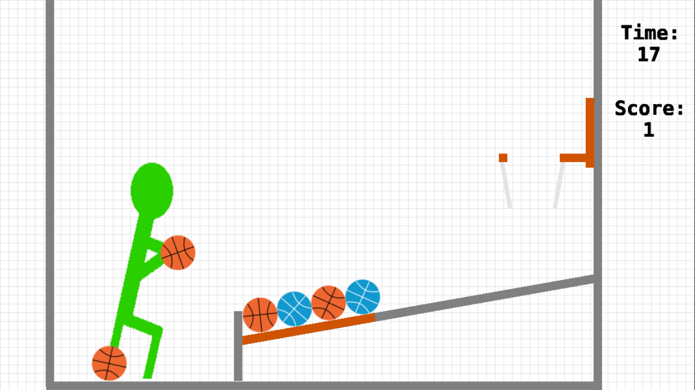
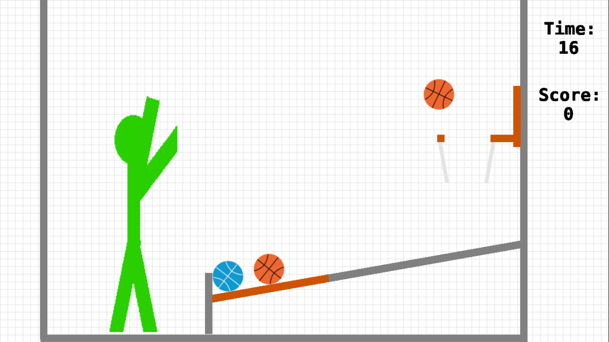

# Stick Basketball Arcade

A 2D Basketball Arcade Game! 🏀

A [Ludum Dare 50](https://ldjam.com/events/ludum-dare/50) game 🎮

# Jam Version

The `ludum-dare-50` branch contains the code used during the jam itself, like a "time capsule"

# How to play

- Like with arcade games outside, shoot as many balls before the timer runs out! 🧺

- While the timer running out is inevitable, watch out for bonus balls, which give extra time ⏲️

- Click and drag balls to aim 🏀

- Any ball within the left half of the court is grabbable (or reboundable!) 

# Screenshots

# Dependencies

This game uses the [Defold-Input](https://github.com/britzl/defold-input) library as a dependency ([license](https://github.com/britzl/defold-input/blob/8b81fe86ef58273cee91a5ae36f046e8dc516297/LICENSE.md))

---------------------------------

# Welcome to Defold

This project was created from the "desktop" project template. This means that the settings in ["game.project"](defold://open?path=/game.project) have been changed to be suitable for a desktop game:

- The screen size is set to 1280x720
- Projection is set to Fixed Fit
- macOS and Windows icons are set
- Mouse clicks are bound to action "touch"
- A simple script in a game object is set up to receive and react to input

[Build and run](defold://build) to see it in action. You can of course alter these settings to fit your needs.

Check out [the documentation pages](https://defold.com/learn) for examples, tutorials, manuals and API docs.

If you run into trouble, help is available in [our forum](https://forum.defold.com).

Happy Defolding!

---
